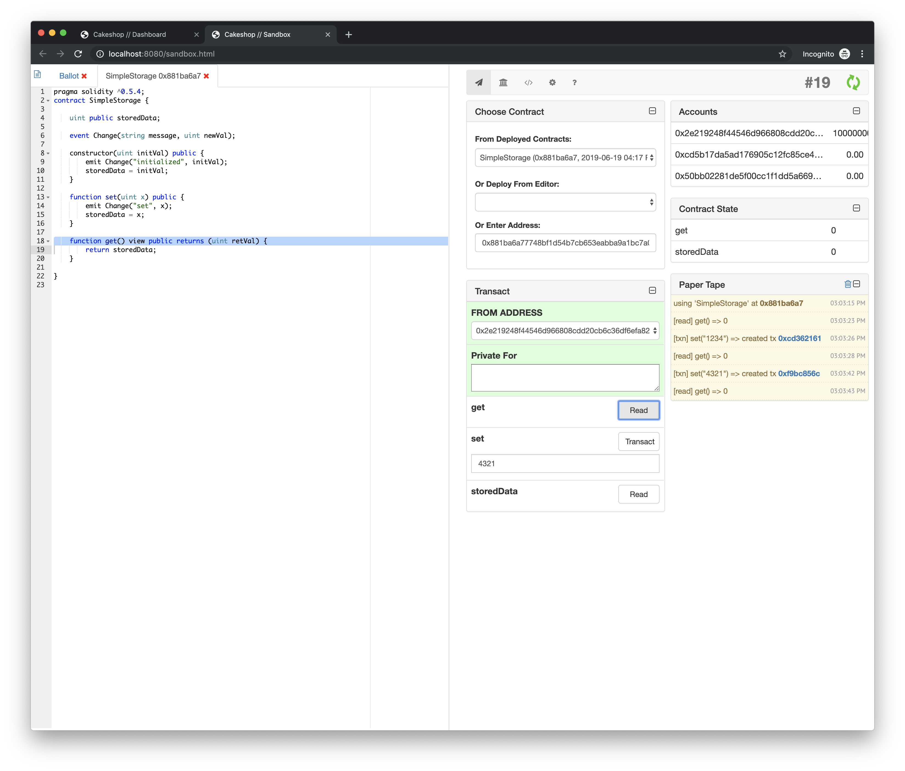

# Cakeshop

An integrated development environment and SDK for Ethereum-like ledgers




## What is it?

_Cakeshop_ is a set of tools and APIs for working with [Ethereum](https://ethereum.org/)-like ledgers, packaged as a Java web application archive (WAR) that gets you up and running in under 60 seconds.

Included in the package is the [geth](https://github.com/ethereum/go-ethereum)
Ethereum server, a [Solidity](https://solidity.readthedocs.org/en/latest/)
compiler and all dependencies.

It provides tools for managing a local blockchain node, setting up clusters,
exploring the state of the chain, and working with contracts.

## Download

Binary packages are available for macOS, Windows, and Linux platforms on the [releases](https://github.com/jpmorganchase/cakeshop/releases) page.

## Quickstart

### Requirements

* Java 7+
* Java app server (Tomcat, Jetty, etc) [Optional]

### Running via Spring Boot

* Download WAR file
* Run `java -jar cakeshop.war`
* Navigate to [http://localhost:8080/cakeshop/](http://localhost:8080/cakeshop/)

### Running via App Server

* Download WAR file
* Put in `/webapps` folder of your app server
* Add Java system property `-Dspring.profiles.active=local` to startup script (`setenv.sh` for tomcat)
* Start app server
* Navigate to [http://localhost:8080/cakeshop/](http://localhost:8080/cakeshop/) (default port is usually 8080)

### Running via Docker

Run via docker and access UI on [http://localhost:8080/cakeshop/](http://localhost:8080/cakeshop/)

```sh
docker run -p 8080:8080 jpmc/cakeshop
```

You'll probably want to mount a data volume:

```sh
mkdir data
docker run -p 8080:8080 -v "$PWD/data":/opt/cakeshop/data jpmc/cakeshop
```

Running under a specific environment

```sh
docker run -p 8080:8080 -v "$PWD/data":/opt/cakeshop/data \
    -e JAVA_OPTS="-Dspring.profiles.active=local" \
    jpmc/cakeshop
```

Note that DAG generation will take time and Cakeshop will not be available until it's complete. If you already have a DAG for epoch 0 in your `$HOME/.ethash` folder, then you can expose that to your container (or just cache it for later):

```sh
docker run -p 8080:8080 -v "$PWD/data":/opt/cakeshop/data \
    -v $HOME/.ethash:/opt/cakeshop/.ethash \
    jpmc/cakeshop
```

### Running with Quorum

This will show you how to quickly setup and connect to the `7nodes` Quorum cluster example from the [quorum-examples](https://github.com/jpmorganchase/quorum-examples) repository. It can be used as a starting point for setting up other integrations.

(requires [VirtualBox](https://www.virtualbox.org/wiki/Downloads) and [Vagrant](https://www.vagrantup.com/downloads.html))

```sh
git clone https://github.com/jpmorganchase/quorum-examples.git
cd quorum-examples
vagrant up
vagrant ssh

# (in vagrant shell)
vagrant$ cd quorum-examples/7nodes
vagrant$ ./init.sh && ./start.sh

# (in host shell)
java -jar cakeshop.war example
java -jar cakeshop.war
```

At this point you should have Cakeshop running and connected to node 1 in the Quorum cluster (dd1 on RPC port 22000).

You can change the node you're connected to by running the last two commands again from another directory and modifying the properties file at `data/local/application.properties` to point to a different RPC port in the range `22000-22006` before starting Cakeshop.

## Further Reading

Further documentation can be found on the [wiki](https://github.com/jpmorganchase/cakeshop/wiki/) and in the [docs](docs/) folder.

## See Also

* [JIF Dashboard](https://github.com/jpmorganchase/jif-dashboard) - The Cakeshop UI was built using the JIF Dashboard framework.

* [solc-cli](https://github.com/jpmorganchase/solc-cli) - The solidity compiler used behind the scenes is `solc-cli`, a thin wrapper atop the [solc](https://github.com/ethereum/solc-js) JS binding.

## Contributing

Thank you for your interest in contributing to Cakeshop!

Cakeshop is built on open source and we fully intend to accept public contributions in the near future. Until then, feel free to file issues and open pull requests, but note that we won't be merging them until the necessary processes are in place.

## License

Copyright (c) 2016 JPMorgan Chase and/or applicable contributors

Licensed under the Apache License, Version 2.0 (the "License");
you may not use this file except in compliance with the License.
You may obtain a copy of the License at

     http://www.apache.org/licenses/LICENSE-2.0

Unless required by applicable law or agreed to in writing, software
distributed under the License is distributed on an "AS IS" BASIS,
WITHOUT WARRANTIES OR CONDITIONS OF ANY KIND, either express or implied.
See the License for the specific language governing permissions and
limitations under the License.

See the [LICENSE](LICENSE) and [THIRD_PARTY](THIRD_PARTY) files for additional license information.
