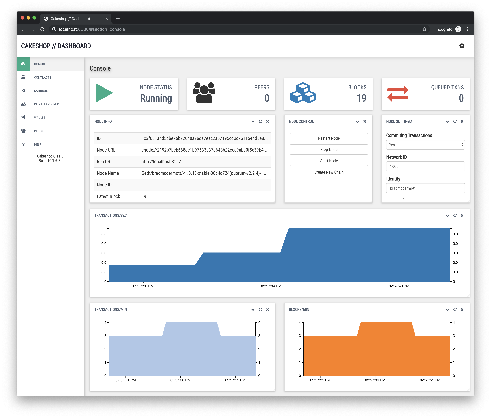

# Cakeshop




## What is it?

_Cakeshop_ is a set of tools and APIs for working with GoQuorum nodes, packaged as a Java web application archive (WAR) that gets you up and running in under 60 seconds.

It provides tools for attaching to GoQuorum nodes, exploring the state of the chain, and working with contracts.

## Download

Binary packages are available on the [Github releases page](https://github.com/ConsenSys/cakeshop/releases).

## Running via GoQuorum Wizard

The easiest way to use Cakeshop is to generate a GoQuorum network with [GoQuorum Wizard](https://docs.goquorum.consensys.net/en/stable/HowTo/GetStarted/Wizard/GettingStarted/) and choose to deploy Cakeshop alongside the network.

## Running via Spring Boot

### Requirements

* Java 11+
* NodeJS (if the nodejs binary on your machine isn't called 'node', see [here](docs/configuration.md#cakeshop-internals))

### Running

* Download WAR file
* Run `java -jar cakeshop.war`
* Navigate to [http://localhost:8080/](http://localhost:8080/)


## Running via Docker

Simple example of running via docker on port 8080:

```sh
docker run -p 8080:8080 quorumengineering/cakeshop
```

Then access the UI at [http://localhost:8080/](http://localhost:8080/)

### Docker Customizations
You can add some extra flags to the run command to further customize cakeshop.

Here is an example where you mount `./data` as a data volume for the container to use:

```sh
mkdir data
docker run -p 8080:8080 -v "$PWD/data":/opt/cakeshop/data quorumengineering/cakeshop
```

An example providing an initial nodes.json in the data directory and configuring it to be used:

```sh
# makes sure you have nodes.json at $PWD/data/nodes.json
docker run -p 8080:8080 -v "$PWD/data":/opt/cakeshop/data \
    -e JAVA_OPTS="-Dcakeshop.initialnodes=/opt/cakeshop/data/nodes.json" \
    quorumengineering/cakeshop
```

## Further Reading

Further documentation can be found [here](https://docs.goquorum.consensys.net/en/stable/Concepts/Cakeshop/).

## See Also

* [JIF Dashboard](https://github.com/jpmorganchase/jif-dashboard) - The Cakeshop UI was built using the JIF Dashboard framework.

* [solc-cakeshop-cli](https://github.com/ConsenSys/solc-cakeshop-cli) - The solidity compiler used behind the scenes is `solc-cakeshop-cli`, a thin wrapper atop the [solc](https://github.com/ethereum/solc-js) JS binding.

## Contributing

Thank you for your interest in contributing to Cakeshop!

Cakeshop is built on open source and we invite you to contribute enhancements. Upon review you will be required to complete a Contributor License Agreement (CLA) before we are able to merge. If you have any questions about the contribution process, please feel free to send an email to [info@goquorum.com](mailto:info@goquorum.com).


## Reporting Security Bugs
Security is part of our commitment to our users. At Quorum we have a close relationship with the security community, we understand the realm, and encourage security researchers to become part of our mission of building secure reliable software. This section explains how to submit security bugs, and what to expect in return.

All security bugs in [GoQuorum](https://github.com/ConsenSys/quorum) and its ecosystem ([Tessera](https://github.com/ConsenSys/tessera), [Constellation](https://github.com/ConsenSys/constellation), [Cakeshop](https://github.com/ConsenSys/cakeshop), ..etc)  should be reported by email to [info@goquorum.com](mailto:info@goquorum.com). Please use the prefix **[security]** in your subject. This email is delivered to the Quorum security team. Your email will be acknowledged, and you'll receive a more detailed response to your email as soon as possible indicating the next steps in handling your report. After the initial reply to your report, the security team will endeavor to keep you informed of the progress being made towards a fix and full announcement.

If you have not received a reply to your email or you have not heard from the security team please contact any team member through quorum slack security channel. **Please note that Quorum slack channels are public discussion forum**. When escalating to this medium, please do not disclose the details of the issue. Simply state that you're trying to reach a member of the security team.

#### Responsible Disclosure Process
Quorum project uses the following responsible disclosure process:

- Once the security report is received it is assigned a primary handler. This person coordinates the fix and release process.
- The issue is confirmed and a list of affected software is determined.
- Code is audited to find any potential similar problems.
- If it is determined, in consultation with the submitter, that a CVE-ID is required, the primary handler will trigger the process.
- Fixes are applied to the public repository and a new release is issued.
- On the date that the fixes are applied, announcements are sent to Quorum-announce.
- At this point you would be able to disclose publicly your finding.

**Note:** This process can take some time. Every effort will be made to handle the security bug in as timely a manner as possible, however it's important that we follow the process described above to ensure that disclosures are handled consistently.  

#### Receiving Security Updates
The best way to receive security announcements is to subscribe to the Quorum-announce mailing list/channel. Any messages pertaining to a security issue will be prefixed with **[security]**.

Comments on This Policy
If you have any suggestions to improve this policy, please send an email to info@goquorum.com for discussion.

## License

Copyright (c) 2016-2021 Consensys and/or applicable contributors

Licensed under the Apache License, Version 2.0 (the "License");
you may not use this file except in compliance with the License.
You may obtain a copy of the License at

     http://www.apache.org/licenses/LICENSE-2.0

Unless required by applicable law or agreed to in writing, software
distributed under the License is distributed on an "AS IS" BASIS,
WITHOUT WARRANTIES OR CONDITIONS OF ANY KIND, either express or implied.
See the License for the specific language governing permissions and
limitations under the License.

See the [LICENSE](LICENSE) and [THIRD_PARTY](THIRD_PARTY) files for additional license information.

# Getting Help
Stuck at some step? Please join our <a href="https://www.goquorum.com/slack-inviter" target="_blank" rel="noopener">slack community</a> for support.
